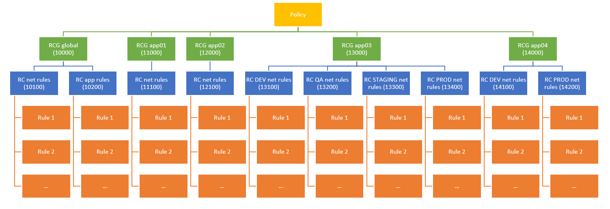
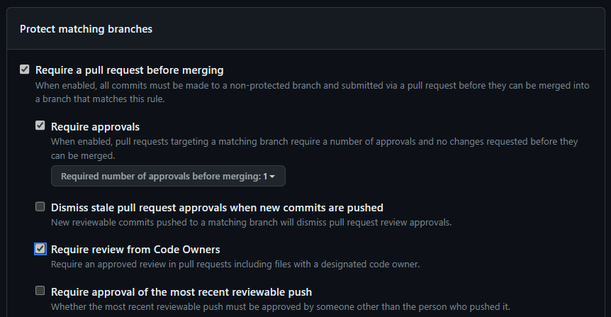
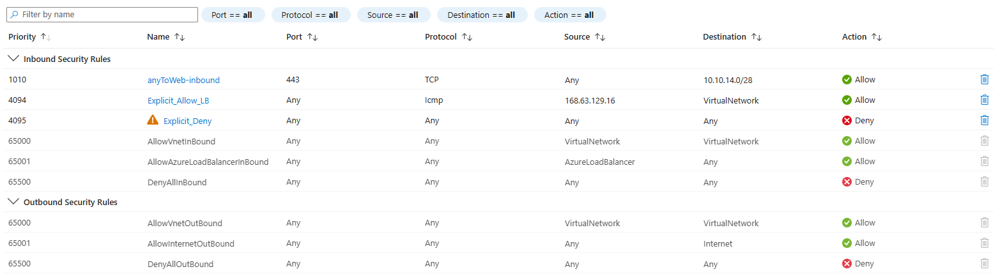

# Azure Network Segmentation Infrastructure as Code

This repo contains examples of different IaC approaches for network-as-code in Azure. To illustrate different approaches and techniques this repo will focus on Azure network segmentation technologies, namely:

- Azure Firewall Policy: deployed centrally into the connectivity subscription where the Azure Firewall resides, but needs input from each workload (the firewall admin relies on the workload admins to define the rules required by each workload to work properly).
- Network Security Groups: deployed in a distributed manner in the workload's subscription, but needs shared rules required by compliance (for example, having an explicit `deny` after the `allow` rules).

## Monorepo vs Multirepo

We will use as well monorepo and multirepo examples. In essence, in a monorepo design all templates will be in the same repository, while in a multirepo design each workload has its own repo. There are many aspects to consider when deciding to go for either monorepo or multirepo, here a brief summary:

| | **Monorepo** | **Multirepo** |
| --- | --- | --- |
| **Access permissions** | Hard, since it needs to be done on a folder-by-folder basis | Easy, since it is done on a repo-by-repo basis |
| **Building the templates** | Easy, all the files in one repo | Complex, files across multiple repos need to be put together |
| **Github workflow management** | Hard, many different actions and workflows in one single repo | Easy, only workflows and actions relevant to one specific workload (and its environments) in any given repo

Whether monorepo or multirepo is best for your organization depends on many things (such as how different departments interact with each other), but lately the industry seems to be converging to multirepo, having all workload-specific configuration (including NSG and firewall rules) in dedicated repositories.

This repo covers 4 apps, where 3 of them are using the monorepo pattern, and the last one the multirepo pattern:

- app01, app02, app03: all configured in the same repo (this one, [segmentation-iac](https://github.com/erjosito/segmentation-iac))).
- app04: configured in a dedicated repo ([segmentation-iac-app04](https://github.com/erjosito/segmentation-iac-app04)).

## ARM vs bicep

This repo contains examples of both ARM and bicep. ARM is mostly included to show the additional complexity that ARM-based IaC incurs into, due to its more limited file processing capabilities as compared to bicep:

- ARM modularity is quite limited, and you can only define nested templates referring to URLs and not path files
- ARM lacks functions to load JSON/YAML code into templates

This repo is not aiming to deliver a full discussion on different IaC approaches (for example, Terraform is not included), but just on highlighting how the support for certain functionality in your IaC language of choice can drive the complexity of the final repository design.

## Azure Firewall Policy: shared infra, monorepo

We will start the discussion with examples to deploy an Azure Firewall Policy in a monorepo design (with three workloads app01, app02, app03). As described earlier, the Azure Firewall policy is a resource that is centrally deployed in the connectivity subscription.

### Azure Firewall Policy hierarchy design

Azure Firewall has a 3-level hierarchy, with some rules and limits (see [Azure Firewall Limits](https://learn.microsoft.com/azure/azure-resource-manager/management/azure-subscription-service-limits#azure-firewall-limits))that will determine the grouping:

1. Rules: can be application- or network-based
2. Rule collections (RC): one rule collection can only contain network or application rules, but not both
3. Rule collection groups (RCG): maximum 60 per policy, maximum 2MB per Rule Collection Group. They constitute a top level Azure resource, meaning that dedicated templates can be for them.

For smaller setups (up to 60 applications), each app can take its own Rule Collection Group. This will enable that each app team gets its own RCG, so that deployments impacting one team will not affect others (since the RCG is an independent resource in Azure).

For larger deployments, a rule collection group would represent a group of applications or Line of Business, and individual applications would get dedicated rule collections.

This repo implements the following hierarchy:



Some remarks:

- For each workload, a single rule collection group implements all environments and both network and application rules (a single rule collection cannot contain a combination of both)
- Some workloads will not have multiple environments, or some workloads will not require both network and application rules
- The rule collection group template for each workload will be stored in the workload's folder (for monorepo designs, in this example [app01](app01/bicep/rcgwrapper-app01.bicep), [app02](app02/bicep/rcgwrapper-app02.bicep) and [app03](app03/bicep/rcgwrapper-app03.bicep)) or in the workload's repo (for multirepo design, in this example [app04](https://github.com/erjosito/segmentation-iac-app04/blob/master/app04/azfw-app04.bicep)).

### Best practice #1: Use separate files

Separate files for each administrative domain in your organization (like application owner groups) will help you to manage access to each item separately and configure different [code owners](https://docs.github.com/en/repositories/managing-your-repositorys-settings-and-features/customizing-your-repository/about-code-owners).

Ideally you can separate files at resource boundaries. For example, you can have different files per Rule Collection Group (as in [app01](./app01/) and [app02](./app02/) or [app03](./app03/) in the examples in this repo), and giving access to each Rule Collection Group file to a different application team.

You might need to be more specific. For example, if with the previous scheme you ended up with more than 60 rule collection groups, that wouldn't be supported by Azure Firewall today (check [Azure Limits](https://aka.ms/azurelimit)). You could partition a single Azure resource (the rule collection group in this example) in multiple files, for example using the Azure bicep functions [loadJsonContent](https://learn.microsoft.com/en-us/azure/azure-resource-manager/bicep/bicep-functions-files#loadjsoncontent) and [loadYamlContent](https://learn.microsoft.com/en-us/azure/azure-resource-manager/bicep/bicep-functions-files#loadyamlcontent). You can see an example of this setup in this repo, in the [app03 folder](app03/bicep/rcg-app03.bicep), where app03's RCG loads up the the rule collections for each environment (test, qa, staging and prod) from a JSON file specific to each environment.

An alternative approach can be seen in the [app03 ARM directory](./app03/ARM), where the script [merge_rcg.py](scripts/merge_rcg.py) consolidates the different files into a single one.

### Single vs multiple templates

Two different approaches are presented in this repo, mostly derived of the differences between ARM and bicep (Terraform would be closer to bicep than to ARM here) regarding templates:

1. Option 1 (recommended): **single template**. This the approach followed in the [bicep directory](shared/bicep/). Whenever anything changes in any of the files, the whole lot is deployed again. Since the templates are idempotent, applying everything shouldn't trigger any change on resources that do not have changes. One benefit of this approach is that the dependencies are taken care of inside of the template, for example making sure that IP groups are created before the rule collection groups, so the [workflow](.github/workflows/check_bicep_code.yml) is kept relatively simple.
1. Option 2: **multiple templates**. This is the approach followed in the [ARM directory](shared/ARM/). While this approach gives a more granular control on the templates that are deployed, it moves the dependency logic from inside the template to the [Github workflow](.github/workflows/deploy_azfw_arm.yml). ARM doesn't have such an advanced file management mechanism like bicep or Terraform, so if you are going with ARM this might be they only possible approach that allows to keep files separated.

### Use Github actions to validate code

Github actions can be used to validate that the different updates to each files don't break your rules. In this repo you can find some examples for validation actions:

- Shell-based:
    - [ipgroups_max](.github/actions/ipgroups_max/) verifies that the total number of IP Groups defined across the repository doesn't exceed a certain configurable maximum. This example sets the maximum to 80, below the current limit of Azure for 100. This action is using a [shell script](.github/actions/ipgroups_max/entrypoint.sh). Shell-based actions are composed of 4 files:
        - [action.yaml](.github/actions/cidr_prefix_length_bicep/action.yml): inputs and outputs are defined.
        - [README.md](.github/actions/ipgroups_max_bicep/README.md): documentation for how to use the action (inputs/outputs)
        - [Dockerfile](.github/actions/cidr_prefix_length_bicep/Dockerfile): this will be used by Github to create a container. It can be the same file for all your shell-based actions.
        - [entrypoint.sh](.github/actions/ipgroups_max_bicep/entrypoint.sh): main logic of the action. It completes successfully if the checks are satisfactory, or with an error (`exit 1`) if checks fail.
- Python-based:
  - [cidr_prefix_length](.github/actions/cidr_prefix_length/): this Github action loads up JSON with a [Python script](.github/actions/cidr_prefix_length/entrypoint.py) to verify that the masks of CIDR prefixes used along the different files are not too broad. This python action includes an additional file:
      - [requirements.txt](.github/actions/cidr_prefix_length_bicep/requirements.txt): Python modules that need to be installed. The [Dockerfile](.github/actions/cidr_prefix_length_bicep/) contains the line `RUN pip3 install -r requirements.txt` to process this file.
  - [cidr_prefix_length_bicep](.github/actions/cidr_prefix_length_bicep/) very similar to the previous one, but in the case of bicep there is no JSON to load. Hence [pycep-parser](https://pypi.org/project/pycep-parser/) needs to be leveraged to transform bicep into JSON before analyzing it. See the [Python script](.github/actions/cidr_prefix_length_bicep/entrypoint.py) for more details.

It is important that you define the file path and extensions that will trigger each check: you don't want to run ARM validation on bicep files or vice versa. In the workflows for [ARM validation](.github/workflows/deploy_azfw_arm.yml) and [bicep validation](.github/workflows/deploy_azfw_bicep.yml) you find examples of this, for example to run the validation only when files in the ARM directory are changed:

```yaml
on:
  pull_request:
    branches: [master]
    paths:
      - '**/ARM/*.json'
```

### Template validation

Additionally to your custom checks, you can let Azure run your template in `Validate` deployment mode to be 100% sure that the template is correct (check [Test your Bicep code by using GitHub Actions](https://learn.microsoft.com/training/modules/test-bicep-code-using-github-actions/) for a whole Azure Learn course on that topic).

The action to validate a template is very similar to the deployment, it only includes an additional line for the `deploymentMode`:

```yaml
- uses: azure/arm-deploy@v1
  name: Run preflight validation for shared infra
  with:
    resourceGroupName: ${{ secrets.AZURE_RG }}
    template: ./shared/bicep/azfwpolicy.bicep
    deploymentMode: Validate
```

### Best practice #2: Use protected branches

In order to make sure that your checks are run before every push, you should [protect](https://docs.github.com/en/repositories/configuring-branches-and-merges-in-your-repository/managing-protected-branches/about-protected-branches) the main/master branch, so that users always need to go through the Pull Request process, and not push straight into the branches. Different tests and checks will be performed in the PR, and a manual approval should be required before merging the PR.



When a PR doesn't satisfy all checks, the PR author will see the test results and will be able to correct them.

### Continuous deployment or nightly deployments

Once a Pull Request is merged, you can decide to deploy straight into the target environment, or whether to wait and deploy all changes at a fixed time, such as once a day. If you go for the continuous deployment option, your worflow should match both the main/master branch as well as the relevant files:

```yaml
on:
  push:
    branches: [master]
    paths:
      - '**/ARM/*.json'
```

If this filtering is not enough, you can use additional in-job filters to control actions, for example with the [dorny/paths-filter](https://github.com/dorny/paths-filter) Github action, as shown in the [ARM workflow](.github/workflows/deploy_azfw_arm.yml).

If going for scheduled deployments, you can leverage the [on.schedule functionality](https://docs.github.com/en/actions/using-workflows/workflow-syntax-for-github-actions#onschedule) in your Github actions. If you would like to deploy **only** if there were some commits in the period, you can use a variable containing the number of commits (24 hours in this example) to determine whether to run the deployment or not:

```yaml
- name: Get number of commits
  run: echo "NEW_COMMIT_COUNT=$(git log --oneline --since '24 hours ago' | wc -l)" >> $GITHUB_ENV
```

### Best practice #3: Manage concurrency

Azure Firewall doesn't support concurrent operations, so you need to configure your workflows to never run concurrently. Github workflows offer the [concurrency](https://docs.github.com/en/actions/using-workflows/workflow-syntax-for-github-actions#concurrency) attribute for jobs to manage this, you can check how the [ARM workflow](.github/workflows/deploy_azfw_arm.yml) and [bicep workflow](.github/workflows/deploy_azfw_arm.yml) for Azure Firewall are configured to belong to the same concurrency group.

## Azure Firewall Policy: shared infra, multirepo

The same concept followed so far can be used as well in multi-repo approaches, where the infra code for other apps is located in remote repositories. In this sample I just checkout the whole remote repository in the workflow. For example, for an `app04` stored in a remote repo `segmentation-iac-app04`, the [bicep workflow](.github/workflows/deploy_azfw_bicep.yml) checks out both the local and the remote repos:

```yaml
  # Checkout local repo
  - name: Checkout local repo
    uses: actions/checkout@main
  # Checkout remote repo for app04 (the path is important, the bicep template expects to find it there)
  - name: Checkout app04 repo
    uses: actions/checkout@v2
    with:
      repository: erjosito/segmentation-iac-app04
      ref: master
      path: './app04'
```

The [bicep template](./shared/bicep/azfwpolicy.bicep) is configured to look for the module `azfw-app04.bicep` in the `app04` folder, where the remote repo will be cloned.

## Network Security Groups: dedicated infra, monorepo

Network Security Groups (NSGs) are an interesting exercise, since opposite to Azure Firewall policies, they are completely distributed.

For example, [infra-app01.bicep](app01/bicep/infra-app01.bicep) contains the infrastructure specific to app01 (in this example only an NSG). In the NSG module [nsg-app01.bicep](app01/bicep/nsg-app01.bicep) you can see the module `sharedInboundRules`, which gets some rules from the [shared](shared/bicep/) folder of the repo.

### Using simplified file formats for management

Some administrators prefer updating simplified versions of the code, instead of managing the bicep, ARM or Terraform files natively. Another usage of the bicep function [loadJsonContent](https://learn.microsoft.com/en-us/azure/azure-resource-manager/bicep/bicep-functions-files#loadjsoncontent) is allowing this way of work, which has been implemented in the repo for [app02](./app02/bicep/).

In this example, admins can work on a [CSV version of the rules](./app02/bicep/nsg-rules-app02.csv), which upon commit will be transformed into JSON by [nsg_csv_to_json.py](scripts/nsg_csv_to_json.py), and then imported into the NSG template in [nsg-app02.bicep](app02/bicep/nsg-app02.bicep) using the [loadJsonContent](https://learn.microsoft.com/en-us/azure/azure-resource-manager/bicep/bicep-functions-files#loadjsoncontent) function.

Here the relevant code of the deploy workflow [deploy_app02_infra.yml](.github/workflows/deploy_app02_infra.yml):

```yml
    # Expand CSV file with NSG rules to JSON
    - name: Expand CSV file with NSG rules to JSON
      run: |
        python3 ./scripts/nsg_csv_to_json.py --csv-file ./app02/bicep/nsg-rules-app02.csv --output-file ./app02/bicep/nsg-rules-app02.json --verbose
    # Log into Azure
    - uses: azure/login@v1
      with:
        creds: ${{ secrets.AZURE_CREDENTIALS }}
    # Deploy bicep template
    - name: Deploy bicep template for global policy
      uses: azure/arm-deploy@v1
      with:
        subscriptionId: ${{ secrets.AZURE_SUBSCRIPTION }}
        resourceGroupName: ${{ secrets.AZURE_RG }}
        template: ./app02/bicep/infra-app02.bicep
        parameters: prefix=app02
```

## Network Security Groups: dedicated infra, multirepo

Looking at our application `app04` with a separate repository ([segmentation-iac-app04](https://github.com/erjosito/segmentation-iac-app04)), this application will be deployed in a different subscription, with a different Virtual Network, and of course different NSGs.

The Azure credentials, including the subscription ID and resource group for `app04` are stored in the secrets of that repo. NSGs should be deployed in the same subscription as the VNet, and hence it is only logical that the deployment workflow runs in the `app04`'s repo (the repo with the shared resources shouldn't need the credentials to the workload's subscription). And yet, the shared repo might contain some required information.

In this example, the shared repo contains some [common NSG rules](./shared/bicep/nsg-shared-inbound-rules.bicep) that are to be inserted in every NSG for all workloads. Consequently, the [workflow in segmentation-iac-app04](https://github.com/erjosito/segmentation-iac-app04/blob/master/.github/workflows/deploy_prod_nsg_bicep.yml) checks out the shared repo as well, and the [NSG bicep template](https://github.com/erjosito/segmentation-iac-app04/blob/master/app04/prod/nsg-app04-prod.bicep) contains a module to be found in the folder where the shared repo is cloned.

After running the template, you can see that the NSG is created with the rules contained in the local repo, and the shared rules from the shared one:



# Conclusion

This repo has demonstrated multiple concepts, such as the following:

- Sharing info across repositories for centralized and distributed resources
- Custom checks using shell and Python scripts
- File management for effective validation and deployment of code
- Azure Firewall structure for rule management across teams
- Implementation of shared NSG rules across the organization
